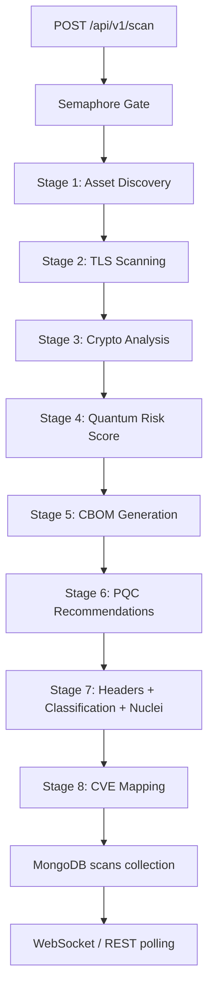
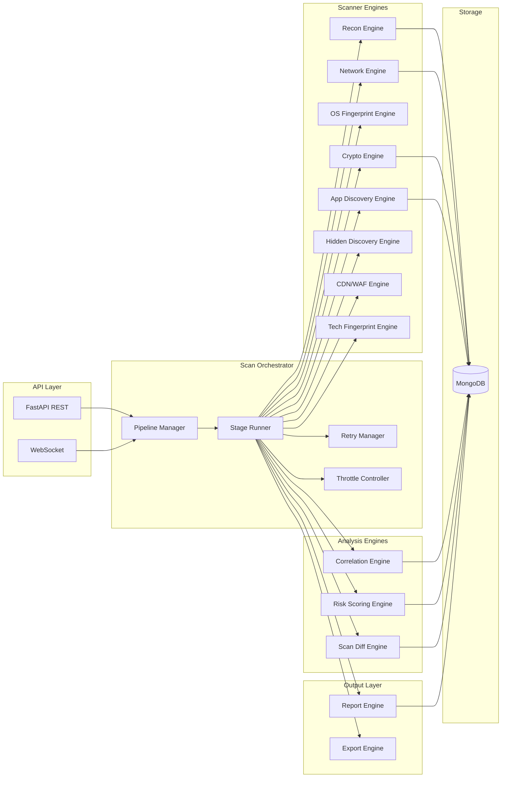

# QuantumShield Domain Intelligence Scanner -- Architecture Blueprint

---

## 1. Current System Understanding

### Architecture as-built

The scanner is a **FastAPI** monolith backed by **MongoDB (Motor)**, with an **Electron + React** frontend. Scans run as `**BackgroundTasks`** with an `**asyncio.Semaphore`** for concurrency control. Real-time progress is pushed via **WebSocket** and **REST polling**.




### Current modules (23 Python files in `app/modules/`)


| Module                    | What it does                                             | Depth                                                        |
| ------------------------- | -------------------------------------------------------- | ------------------------------------------------------------ |
| `asset_discovery.py`      | Subfinder + Amass passive, DNSX, HTTPX, Nmap TCP connect | Passive enum only; nmap has no `-sV`/`-O`; capped at 50 subs |
| `tls_scanner.py`          | sslscan + testssl + zgrab2 + openssl per host:port       | Good TLS depth, but no STARTTLS for non-web ports            |
| `crypto_analyzer.py`      | Rule-based risk from TLS fields                          | Pure derivation, no new data collection                      |
| `quantum_risk_engine.py`  | Weighted category-min scoring                            | Scoring only                                                 |
| `headers_scanner.py`      | Single `HEAD` to `https://{host}/`                       | One URL, one verb, no path coverage                          |
| `vuln_scanner.py`         | Nuclei templates (optional, off by default)              | Template-driven, not deep                                    |
| `cve_mapper.py`           | Static lambda rules against TLSInfo                      | No live CVE API, no NVD, dedup bug                           |
| `asset_classification.py` | HTTP probes on ports 80/443 only                         | Shallow heuristic buckets                                    |
| `cbom_generator.py`       | Deduplicate crypto components                            | Derivation only                                              |


### Critical blind spots

1. **No service/version detection** -- Nmap runs `-Pn -sT` only (TCP connect, no `-sV`, no `-O`). The scanner knows ports are open but not *what* is running on them.
2. **No OS fingerprinting** -- Zero OS detection capability. `DiscoveredAsset` has no OS field.
3. **No technology fingerprinting** -- No Wappalyzer-style detection. `classification_attributes` holds basic heuristics, not real tech stack data.
4. **No web crawling or endpoint discovery** -- Headers scanner does a single `HEAD /`. No spidering, no `robots.txt`/`sitemap.xml` parsing, no directory brute-force, no API schema discovery.
5. **No CDN/WAF/proxy detection** -- `hosting_hint` is a crude label ("third_party_cdn") from cert substring matching. No real WAF fingerprinting.
6. **No reverse DNS, no WHOIS, no ASN/geo enrichment** -- `NameServerInfo` only holds NS records. No PTR, no BGP data, no geolocation.
7. **No asset relationship graph** -- Assets are flat lists. No parent-child, no service-to-host, no IP-to-ASN linking.
8. **No scan diffing** -- `scan_lifecycle.py` handles reuse but never computes deltas between runs.
9. **No structured risk scoring per asset** -- `QuantumScore` is estate-wide. Individual assets lack composite risk scores.
10. **Static CVE mapping** -- 8 hardcoded lambdas. No NVD/MITRE enrichment, Heartbleed matcher returns `False` always.
11. **Pipeline is rigid** -- 8 hardcoded sequential stages. Adding a module requires editing `routes.py` directly.

### Data model gaps in [models.py](Backend/app/db/models.py)

- `DiscoveredAsset`: No fields for OS, services (name/version/product), technologies, geo, ASN, CDN/WAF, reverse DNS
- `TLSInfo`: Missing STARTTLS indicator, OCSP stapling status, CT log presence, HPKP
- `ScanResult`: No scan diff, no per-asset risk score, no relationship graph, no structured evidence trail
- No `ServiceFingerprint`, `TechnologyStack`, `InfrastructureIntel`, `AttackSurface` models

---

## 2. What "Complete Scanning" Means -- Layered Model

```mermaid
flowchart TB
    subgraph surface ["Surface Layer"]
        S1["Subdomains"]
        S2["DNS records (A/AAAA/MX/TXT/CNAME/SOA/NS/PTR)"]
        S3["WHOIS / registrar"]
        S4["Reverse DNS"]
        S5["Certificate Transparency logs"]
    end
    subgraph network ["Network Layer"]
        N1["Port scanning (TCP/UDP)"]
        N2["Service detection (banner grab)"]
        N3["ASN / BGP prefix"]
        N4["GeoIP"]
        N5["Traceroute / hop analysis"]
    end
    subgraph osHost ["OS / Host Fingerprint Layer"]
        O1["TCP/IP stack fingerprint"]
        O2["Banner-based OS inference"]
        O3["HTTP server header OS hints"]
        O4["SSH version / KEX fingerprint"]
        O5["Container indicators"]
    end
    subgraph crypto ["Crypto Layer"]
        C1["TLS versions + cipher suites"]
        C2["Certificate chain + trust"]
        C3["Key exchange + PFS"]
        C4["PQC readiness"]
        C5["OCSP / CRL / CT / HPKP"]
        C6["STARTTLS for SMTP/IMAP/etc"]
    end
    subgraph appLayer ["Application Layer"]
        A1["HTTP headers (security + info leak)"]
        A2["Technology fingerprint (Wappalyzer-style)"]
        A3["CMS / framework detection"]
        A4["API schema discovery (OpenAPI, GraphQL)"]
        A5["Cookie analysis"]
        A6["CORS policy audit"]
    end
    subgraph hidden ["Hidden Layer"]
        H1["robots.txt / sitemap.xml"]
        H2["Well-known URIs"]
        H3["Common path brute-force"]
        H4["Backup file detection"]
        H5["Admin panel detection"]
        H6["Information disclosure"]
    end
    subgraph intel ["Intelligence Layer"]
        I1["Asset correlation graph"]
        I2["Attack path analysis"]
        I3["Risk scoring per asset"]
        I4["Scan diff / delta"]
        I5["CVE enrichment (live NVD)"]
        I6["Prioritized findings"]
        I7["Executive + technical reports"]
    end

    surface --> network --> osHost --> crypto --> appLayer --> hidden --> intel
```




### Per-layer data justification

**Surface layer** -- Subdomains define the attack surface boundary. DNS records reveal mail infrastructure (MX), SPF/DMARC (TXT), cloud delegation (CNAME), and zone transfer misconfigs. WHOIS exposes registrar age, contact patterns. CT logs find certificates issued for unknown subdomains. PTR records map IPs back to hostnames, revealing shared hosting.

**Network layer** -- Open ports are entry points. Service banners reveal software and versions for CVE matching. ASN/BGP tells you the hosting provider and network neighborhood. GeoIP matters for compliance (data residency) and latency analysis.

**OS/Host fingerprint layer** -- Knowing the OS narrows CVE search space. SSH version strings leak OS family + version. Container indicators (`.dockerenv`, low PID namespace, kernel version patterns) reveal deployment topology.

**Crypto layer** -- Already partially covered. Gaps: STARTTLS for mail/DB ports, OCSP stapling (availability assessment), CT log membership (certificate hygiene), per-cipher strength grading beyond PQC.

**Application layer** -- Technology fingerprints (libraries, frameworks, server software) enable precise CVE mapping. API schema discovery exposes the programmable attack surface. Cookie flags and CORS reveal session hijack and cross-origin risks.

**Hidden layer** -- `robots.txt` leaks internal paths. Backup files (`.bak`, `.old`, `~`) contain source code. Admin panels are high-value targets. Information disclosure (version headers, stack traces, debug endpoints) gives attackers free reconnaissance.

**Intelligence layer** -- Raw data without correlation is noise. The graph connects IPs to hosts to services to vulns. Attack paths show which chains of weaknesses lead to impact. Scan diffing shows what changed, enabling continuous monitoring.

---

## 3. Proposed Architecture

### Core services




### Pipeline stages (new 12-stage model)

```
Stage  1: Recon           -- subdomains, DNS all-types, WHOIS, CT logs, reverse DNS
Stage  2: Network         -- port scan (TCP+UDP top), service/version detection, banner grab
Stage  3: OS fingerprint  -- TCP stack analysis, banner inference, SSH KEX
Stage  4: Crypto/TLS      -- existing TLS pipeline + STARTTLS + OCSP + CT + extended cipher grading
Stage  5: CDN/WAF/Proxy   -- WAF fingerprint, CDN detection, reverse proxy identification
Stage  6: Tech fingerprint -- Wappalyzer-style detection, CMS/framework, server software
Stage  7: App discovery   -- headers audit, cookie audit, CORS, API schema, well-known URIs
Stage  8: Hidden discovery -- robots.txt, sitemap, path brute-force, backup files, admin panels
Stage  9: CVE enrichment  -- live NVD matching against detected services + tech stack
Stage 10: Correlation     -- build asset graph, link entities, detect shared infrastructure
Stage 11: Risk scoring    -- per-asset composite score, attack path analysis, prioritization
Stage 12: Reporting       -- diff generation, structured output, executive summary, exports
```

### Pipeline Manager design

The current pipeline is hardcoded in `_run_scan_pipeline` inside [routes.py](Backend/app/api/routes.py). Replace with a **plugin-based stage runner**:

```python
# New file: app/scanner/pipeline.py

class ScanStage:
    """Base class for all scan pipeline stages."""
    name: str
    order: int
    
    async def execute(self, context: ScanContext) -> StageResult:
        raise NotImplementedError
    
    async def on_retry(self, context: ScanContext, error: Exception) -> bool:
        """Return True to retry, False to skip."""
        return False

class ScanContext:
    """Shared mutable state passed through the pipeline."""
    scan_id: str
    domain: str
    request: ScanRequest
    assets: list[DiscoveredAsset]
    services: list[ServiceFingerprint]
    tls_results: list[TLSInfo]
    technologies: list[TechFingerprint]
    findings: list[Finding]
    graph: AssetGraph
    broadcast: Callable  # WebSocket broadcast
    db: AsyncIOMotorDatabase

class PipelineManager:
    """Orchestrates scan stages with retry, throttle, and progress."""
    
    def __init__(self, stages: list[ScanStage], config: PipelineConfig):
        self.stages = sorted(stages, key=lambda s: s.order)
        self.config = config
        self.throttle = ThrottleController(config)
        self.retry = RetryManager(config)
    
    async def run(self, context: ScanContext) -> ScanResult:
        for stage in self.stages:
            await self.throttle.acquire(stage.name)
            result = await self.retry.execute_with_retry(
                stage, context, max_retries=stage.max_retries
            )
            context.update(result)
            await self._broadcast_progress(context, stage)
        return self._build_result(context)
```

### Async execution model

Keep `**asyncio**` (no Celery needed for the current scale). Improvements:

- **Per-stage semaphores** instead of one global semaphore: network scanning gets more concurrency than TLS (which is already heavy)
- `**asyncio.TaskGroup`** (Python 3.11+) for structured concurrency within stages, replacing bare `gather(..., return_exceptions=True)`
- **Circuit breaker** per external tool: if `sslscan` fails 5 times in a row, skip it for remaining hosts in this scan and note degraded confidence

### Retry / error handling

```python
class RetryManager:
    async def execute_with_retry(self, stage, context, max_retries=2):
        for attempt in range(max_retries + 1):
            try:
                return await asyncio.wait_for(
                    stage.execute(context),
                    timeout=stage.timeout_seconds
                )
            except asyncio.TimeoutError:
                if attempt == max_retries:
                    return StageResult(status="timeout", partial=True)
                await asyncio.sleep(2 ** attempt)  # exponential backoff
            except Exception as e:
                should_retry = await stage.on_retry(context, e)
                if not should_retry or attempt == max_retries:
                    return StageResult(status="error", error=str(e), partial=True)
                await asyncio.sleep(2 ** attempt)
```

### Throttle / rate control

```python
class ThrottleController:
    """Per-target and per-tool rate limiting."""
    
    def __init__(self, config):
        self.target_semaphores: dict[str, asyncio.Semaphore] = {}
        self.tool_semaphores = {
            "nmap": asyncio.Semaphore(config.max_nmap_concurrent),      # 3
            "tls_heavy": asyncio.Semaphore(config.max_tls_concurrent),  # 5
            "http_probe": asyncio.Semaphore(config.max_http_concurrent), # 10
            "dns": asyncio.Semaphore(config.max_dns_concurrent),        # 20
        }
    
    def for_target(self, target: str) -> asyncio.Semaphore:
        if target not in self.target_semaphores:
            self.target_semaphores[target] = asyncio.Semaphore(2)
        return self.target_semaphores[target]
```

### Scan diff support

```python
class ScanDiffEngine:
    async def compute_diff(self, current: ScanResult, previous: ScanResult) -> ScanDiff:
        return ScanDiff(
            new_assets=[a for a in current.assets if a.subdomain not in prev_subs],
            removed_assets=[a for a in previous.assets if a.subdomain not in curr_subs],
            new_ports=self._diff_ports(current, previous),
            closed_ports=self._diff_ports(previous, current),
            new_services=self._diff_services(current, previous),
            tls_changes=self._diff_tls(current, previous),
            new_findings=self._diff_findings(current, previous),
            resolved_findings=self._diff_findings(previous, current),
            risk_delta=current.risk_score - previous.risk_score,
        )
```

---

## 4. Custom Engine Design

### 4.1 Recon Engine

**Purpose**: Expand the attack surface map from a single domain to all discoverable related assets.

**Replaces/extends**: [asset_discovery.py](Backend/app/modules/asset_discovery.py)

**Inputs**: Target domain, scan config
**Outputs**: `list[DiscoveredAsset]`, `list[DNSRecord]`, `WhoisInfo`, `list[CTLogEntry]`

**Step-by-step flow**:

1. **Passive subdomain enumeration** (keep existing Subfinder + Amass)
2. **DNS zone walk** -- query A, AAAA, MX, TXT, CNAME, SOA, NS, SRV, CAA for root + each subdomain via `dnspython`
3. **Certificate Transparency search** -- query `crt.sh` API (`https://crt.sh/?q=%.{domain}&output=json`) to find certs issued for unknown subdomains, merge new ones back
4. **Reverse DNS (PTR)** -- for each resolved IP, query PTR record to discover hostnames sharing the IP
5. **WHOIS lookup** -- `python-whois` for registrar, creation date, expiry, nameservers
6. **ASN/BGP enrichment** -- query Team Cymru DNS (`TXT {reversed_ip}.origin.asn.cymru.com`) for ASN number, then `TXT AS{asn}.peer.asn.cymru.com` for org name
7. **GeoIP** -- use `geoip2` (MaxMind GeoLite2 free DB) for country/city/coordinates per IP
8. **DNS liveness** (existing DNSX) + **HTTP probe** (existing HTTPX)

**Key data structures**:

```python
class DNSRecord(BaseModel):
    hostname: str
    record_type: str   # A, AAAA, MX, TXT, CNAME, SOA, NS, SRV, CAA, PTR
    value: str
    ttl: Optional[int] = None

class WhoisInfo(BaseModel):
    domain: str
    registrar: Optional[str] = None
    creation_date: Optional[datetime] = None
    expiry_date: Optional[datetime] = None
    nameservers: list[str] = []
    dnssec: Optional[bool] = None

class CTLogEntry(BaseModel):
    common_name: str
    issuer: str
    not_before: Optional[str] = None
    not_after: Optional[str] = None
    serial: Optional[str] = None

class ASNInfo(BaseModel):
    asn: Optional[int] = None
    org: Optional[str] = None
    prefix: Optional[str] = None

class GeoInfo(BaseModel):
    country: Optional[str] = None
    city: Optional[str] = None
    latitude: Optional[float] = None
    longitude: Optional[float] = None
```

**Implementation**: New file `app/scanner/engines/recon.py`. The CT log query and WHOIS are `httpx` async calls. DNS queries use `dnspython`'s `asyncresolver`. ASN lookup is a DNS TXT query (no external API key needed).

---

### 4.2 Network Scanning Engine

**Purpose**: Discover open ports and identify the services running on them with version information.

**Replaces/extends**: `scan_ports()` in [asset_discovery.py](Backend/app/modules/asset_discovery.py)

**Inputs**: `list[DiscoveredAsset]` with IPs
**Outputs**: Updated assets with `list[ServiceFingerprint]` per host

**Step-by-step flow**:

1. **TCP SYN/connect scan** -- Nmap with `-sV` (version detection) added to existing `-Pn -sT` flags
2. **Top UDP ports** -- Nmap `-sU --top-ports 20` for DNS/SNMP/NTP/TFTP (requires root; graceful skip if no permission)
3. **Banner grabbing** -- for each open port, custom async socket connect + read first 4096 bytes (raw banner), timeout 5s
4. **Service identification** -- parse Nmap XML (`-oX -`) instead of grepable output; extract `service@name`, `@product`, `@version`, `@extrainfo`, `@ostype`
5. **Protocol detection** -- classify ports into protocol categories (HTTP, HTTPS, SSH, SMTP, IMAP, FTP, DB, etc.) based on Nmap service name + banner content

**Key data structures**:

```python
class ServiceFingerprint(BaseModel):
    host: str
    port: int
    protocol: str            # tcp / udp
    state: str               # open / filtered / closed
    service_name: Optional[str] = None    # http, ssh, smtp, mysql, etc.
    product: Optional[str] = None         # Apache httpd, OpenSSH, etc.
    version: Optional[str] = None         # 2.4.51, 8.9p1, etc.
    extra_info: Optional[str] = None      # Ubuntu, protocol 2.0, etc.
    raw_banner: Optional[str] = None
    os_hint: Optional[str] = None         # from Nmap service detection
    confidence: ConfidenceLevel = ConfidenceLevel.MEDIUM
```

**Implementation**: New file `app/scanner/engines/network.py`. Parse Nmap XML with `xml.etree.ElementTree` (already in stdlib). Banner grabber is a custom `asyncio.open_connection` with `asyncio.wait_for`.

---

### 4.3 OS Fingerprinting Engine

**Purpose**: Determine the operating system, runtime, and deployment topology of each host.

**Inputs**: `list[DiscoveredAsset]`, `list[ServiceFingerprint]`, HTTP response headers
**Outputs**: `list[OSFingerprint]`

**Step-by-step flow**:

1. **TCP/IP stack analysis** (Nmap `-O` when running as root; else skip with confidence downgrade)
2. **Banner-based inference** -- parse SSH banners (`SSH-2.0-OpenSSH_8.9p1 Ubuntu-3ubuntu0.1` -> Ubuntu 22.04), SMTP banners, FTP banners
3. **HTTP Server header** -- `Server: Apache/2.4.52 (Ubuntu)`, `Server: Microsoft-IIS/10.0`, `Server: nginx/1.18.0`
4. **X-Powered-By / Via headers** -- `X-Powered-By: PHP/8.1.2`, `X-Powered-By: Express`
5. **TTL analysis** -- initial TTL from TCP handshake: 64 = Linux, 128 = Windows, 255 = network device
6. **Container indicators** -- presence of `.dockerenv`, specific header patterns, low TTL variance, Kubernetes-style hostnames (`*-deployment-`*)

**Key data structures**:

```python
class OSFingerprint(BaseModel):
    host: str
    os_family: Optional[str] = None        # Linux, Windows, macOS, FreeBSD
    os_version: Optional[str] = None       # Ubuntu 22.04, Windows Server 2019
    os_confidence: ConfidenceLevel = ConfidenceLevel.LOW
    runtime: Optional[str] = None          # Node.js 18, Python 3.11, Java 17
    container_likely: bool = False
    container_evidence: list[str] = []
    evidence_sources: list[str] = []       # ["ssh_banner", "http_server", "ttl"]
```

**Implementation**: `app/scanner/engines/os_fingerprint.py`. A rule engine with weighted evidence. Each evidence source contributes a vote; the OS with the most weighted votes wins. SSH banner parsing uses regex patterns for known distributions.

---

### 4.4 TLS / Crypto Analysis Engine

**Purpose**: Deep cryptographic posture assessment for every TLS-capable port, including non-HTTPS protocols.

**Extends**: [tls_scanner.py](Backend/app/modules/tls_scanner.py) + [crypto_analyzer.py](Backend/app/modules/crypto_analyzer.py)

**Additions to existing pipeline**:

1. **STARTTLS support** -- for SMTP (port 25/587), IMAP (143), POP3 (110), FTP (21), LDAP (389), XMPP (5222): use `openssl s_client -starttls {protocol}` and `testssl --starttls {protocol}`
2. **OCSP stapling check** -- `openssl s_client -status` and parse for OCSP response
3. **Certificate Transparency** -- check if cert has SCT (Signed Certificate Timestamp) embedded or via TLS extension
4. **Full cipher enumeration** -- enumerate all accepted ciphers (not just negotiated), classify each: `ECDHE-RSA-AES256-GCM-SHA384` -> {kex: ECDHE, auth: RSA, enc: AES-256-GCM, mac: SHA384}
5. **TLS compression** (CRIME vulnerability check)
6. **Renegotiation support** (client-initiated = vulnerability)
7. **Session resumption** -- ticket vs session-id

**New fields on `TLSInfo`**:

```python
starttls_protocol: Optional[str] = None   # smtp, imap, pop3, ftp, ldap, xmpp
ocsp_stapling: Optional[bool] = None
sct_present: Optional[bool] = None
compression_supported: Optional[bool] = None
secure_renegotiation: Optional[bool] = None
session_resumption: Optional[str] = None   # "ticket" | "session_id" | "none"
all_accepted_ciphers_parsed: list[CipherDetail] = []

class CipherDetail(BaseModel):
    name: str
    kex: str
    auth: str
    encryption: str
    mac: str
    bits: int
    strength: str  # strong / acceptable / weak / insecure
    pfs: bool
```

---

### 4.5 Web and API Discovery Engine

**Purpose**: Map the web application attack surface -- endpoints, APIs, cookies, CORS, security headers across all paths.

**Extends**: [headers_scanner.py](Backend/app/modules/headers_scanner.py)

**Step-by-step flow**:

1. **Full header audit** on `GET /` (upgrade from `HEAD`) -- capture `Server`, `X-Powered-By`, `X-AspNet-Version`, `X-Generator`, all security headers, all `Set-Cookie` attributes
2. **Cookie analysis** -- check `Secure`, `HttpOnly`, `SameSite`, `Path`, `Domain`, `__Host-`/`__Secure-` prefixes, expiry
3. **CORS audit** -- send `Origin: https://evil.com`, check `Access-Control-Allow-Origin`, `Allow-Credentials`
4. **API schema discovery** -- probe:
  - `GET /openapi.json`, `/swagger.json`, `/api-docs`, `/v1/openapi.json`
  - `POST /graphql` with introspection query `{ __schema { types { name } } }`
  - `GET /.well-known/openid-configuration`
5. **Well-known URIs** -- `/.well-known/security.txt`, `/.well-known/change-password`, `/.well-known/apple-app-site-association`, `/.well-known/assetlinks.json`
6. **Form and input detection** -- regex scan of HTML response for `<form>`, `<input>`, `action=` attributes (single page, no crawl)

**Key data structures**:

```python
class WebAppProfile(BaseModel):
    host: str
    url: str
    status_code: int
    response_headers: dict[str, str]
    security_headers: SecurityHeadersAudit
    cookies: list[CookieAudit]
    cors: CORSAudit
    api_schemas: list[APISchemaDiscovery]
    well_known: dict[str, WellKnownResult]
    forms_detected: int
    info_leaks: list[InfoLeak]

class CookieAudit(BaseModel):
    name: str
    secure: bool
    http_only: bool
    same_site: Optional[str] = None
    path: Optional[str] = None
    issues: list[str] = []

class CORSAudit(BaseModel):
    origin_tested: str
    acao: Optional[str] = None          # Access-Control-Allow-Origin
    credentials_allowed: bool = False
    is_permissive: bool = False         # wildcard or reflects origin
    risk: RiskLevel = RiskLevel.LOW
```

**Implementation**: `app/scanner/engines/web_discovery.py`. Uses `httpx.AsyncClient` with redirect following, timeout per probe. HTML parsing for forms uses regex (no heavy dependency like BeautifulSoup needed for shallow extraction).

---

### 4.6 Hidden Endpoint Discovery Engine

**Purpose**: Find paths, files, and interfaces that are not linked but are accessible.

**Inputs**: `list[DiscoveredAsset]` with web surface
**Outputs**: `list[HiddenFinding]`

**Step-by-step flow**:

1. **robots.txt parsing** -- extract all `Disallow:` and `Allow:` paths, probe each for `200/301/302/403`
2. **sitemap.xml parsing** -- recursive sitemap index + URL extraction
3. **Common path probing** -- curated wordlist (~200 high-value paths): `/admin`, `/wp-admin`, `/phpmyadmin`, `/api/`, `/debug`, `/status`, `/health`, `/metrics`, `/env`, `/.env`, `/config`, `/backup`, `/.git/HEAD`, `/server-status`, `/.DS_Store`, `/web.config`, etc.
4. **Backup file detection** -- for discovered paths, test `{path}.bak`, `{path}.old`, `{path}~`, `{path}.swp`, `{path}.orig`
5. **Status code analysis** -- 200 = accessible, 403 = exists but forbidden (still informative), 301/302 = redirect (follow and log), 401 = auth required (exists)

**Key data structures**:

```python
class HiddenFinding(BaseModel):
    host: str
    path: str
    method: str                 # GET
    status_code: int
    content_type: Optional[str] = None
    content_length: Optional[int] = None
    discovery_source: str       # robots_txt, sitemap, brute_force, backup_probe
    risk: RiskLevel
    evidence: str               # "robots.txt Disallow: /admin" or "200 OK on /.env"
    confidence: ConfidenceLevel
```

**Implementation**: `app/scanner/engines/hidden_discovery.py`. Wordlist stored as `app/scanner/data/common_paths.txt`. Requests use `httpx.AsyncClient` with semaphore (20 concurrent), 5s timeout per probe.

---

### 4.7 CDN / WAF / Proxy Detection Engine

**Purpose**: Identify infrastructure layers that sit between the client and origin server.

**Inputs**: HTTP response headers, DNS records, IP addresses
**Outputs**: `list[InfrastructureIntel]`

**Step-by-step flow**:

1. **CDN detection by DNS CNAME** -- `*.cloudfront.net` -> CloudFront, `*.cdn.cloudflare.net` -> Cloudflare, `*.akamaiedge.net` -> Akamai, `*.fastly.net` -> Fastly, etc.
2. **CDN detection by response headers** -- `cf-ray` -> Cloudflare, `x-amz-cf-id` -> CloudFront, `x-cache` -> generic CDN, `x-served-by` -> Fastly/Varnish
3. **WAF fingerprinting** -- send known-malicious payloads in query string (e.g., `?test=<script>alert(1)</script>`, `?test=' OR 1=1--`):
  - Cloudflare: `cf-chl-bypass`, 403 with "Attention Required" body
  - AWS WAF: `x-amzn-waf-`* headers
  - Akamai: `AkamaiGHost` server header
  - ModSecurity: 403 with "ModSecurity" in body
  - Generic: 403/406/429 on malicious input where clean request returns 200
4. **Reverse proxy detection** -- `Via` header, `X-Forwarded-For` reflection, `Server` vs actual service mismatch
5. **Cloud provider by IP range** -- match IP against published CIDR ranges (AWS, Azure, GCP, Cloudflare publish these as JSON)

**Key data structures**:

```python
class InfrastructureIntel(BaseModel):
    host: str
    cdn_provider: Optional[str] = None
    cdn_evidence: list[str] = []
    waf_detected: bool = False
    waf_provider: Optional[str] = None
    waf_evidence: list[str] = []
    reverse_proxy: Optional[str] = None
    cloud_provider: Optional[str] = None
    cloud_evidence: list[str] = []
    asn_info: Optional[ASNInfo] = None
    geo_info: Optional[GeoInfo] = None
```

**Implementation**: `app/scanner/engines/cdn_waf.py`. CDN CIDR ranges stored as `app/scanner/data/cloud_ranges.json` (downloadable, cacheable). WAF probing uses the same `httpx.AsyncClient` with a comparison between clean and malicious responses.

---

### 4.8 Technology Fingerprinting Engine

**Purpose**: Identify the full technology stack (web server, language, framework, CMS, JS libraries, analytics) from observable signals.

**Inputs**: HTTP responses (headers + body), `list[ServiceFingerprint]`
**Outputs**: `list[TechFingerprint]`

**Step-by-step flow**:

1. **Header-based detection** -- `Server`, `X-Powered-By`, `X-AspNet-Version`, `X-Generator`, `X-Drupal-Cache`, etc.
2. **HTML meta tags** -- `<meta name="generator" content="WordPress 6.4.2">`, `<meta name="framework" content="...">`
3. **Script/link analysis** -- scan `<script src="...">` and `<link href="...">` in HTML for known patterns:
  - `/wp-content/` -> WordPress
  - `/sites/default/files/` -> Drupal
  - `react.production.min.js` -> React
  - `angular.min.js` -> Angular
  - `jquery-3.6.0.min.js` -> jQuery 3.6.0
4. **Cookie names** -- `JSESSIONID` -> Java, `PHPSESSID` -> PHP, `ASP.NET_SessionId` -> .NET, `connect.sid` -> Express/Node
5. **Response body patterns** -- specific HTML comments, class names (`wp-block-`*), JS global variables
6. **Favicon hash** -- MD5 of `/favicon.ico`, compare against known database (e.g., Shodan-style)

**Key data structures**:

```python
class TechFingerprint(BaseModel):
    host: str
    category: str       # web_server, language, framework, cms, js_library, analytics, cdn
    name: str           # nginx, PHP, Laravel, WordPress, React, Google Analytics
    version: Optional[str] = None
    confidence: ConfidenceLevel
    evidence: str       # "Server: nginx/1.18.0" or "cookie PHPSESSID detected"
    cpe: Optional[str] = None  # CPE string for CVE matching: cpe:2.3:a:nginx:nginx:1.18.0
```

**Implementation**: `app/scanner/engines/tech_fingerprint.py`. Fingerprint rules stored as `app/scanner/data/tech_signatures.json` (a simplified Wappalyzer-style catalog). Each signature has: `name`, `category`, `match_type` (header/cookie/html/script/meta), `pattern` (regex), optional `version_regex`, `confidence`.

---

### 4.9 Correlation / Graph Engine

**Purpose**: Build a connected intelligence graph from all scan data, enabling relationship discovery and attack path analysis.

**Inputs**: All outputs from stages 1-8
**Outputs**: `AssetGraph`

**Step-by-step flow**:

1. **Node creation** -- one node per: domain, subdomain, IP, service, certificate, technology, ASN, finding
2. **Edge creation**:
  - domain -> subdomain (DNS)
  - subdomain -> IP (A record)
  - IP -> ASN (BGP)
  - IP -> Geo (GeoIP)
  - host:port -> service (port scan)
  - service -> technology (fingerprint)
  - service -> TLS (crypto)
  - technology -> CVE (vulnerability)
  - host -> certificate (TLS)
  - certificate -> CA (trust chain)
3. **Shared infrastructure detection** -- hosts sharing IPs, certs, or ASN
4. **Attack path derivation** -- from external surface through weakest links to highest-value assets

**Key data structures**:

```python
class GraphNode(BaseModel):
    id: str                 # unique: "host:example.com", "ip:1.2.3.4", "svc:example.com:443:https"
    node_type: str          # domain, subdomain, ip, service, certificate, technology, asn, finding
    label: str
    properties: dict = {}

class GraphEdge(BaseModel):
    source: str             # node id
    target: str             # node id
    relationship: str       # resolves_to, runs_on, uses, trusts, vulnerable_to, etc.
    properties: dict = {}

class AssetGraph(BaseModel):
    nodes: list[GraphNode]
    edges: list[GraphEdge]
    
    def subgraph_for_host(self, host: str) -> "AssetGraph": ...
    def attack_paths(self, max_depth: int = 5) -> list[list[GraphNode]]: ...
    def shared_infrastructure(self) -> list[list[str]]: ...
```

**Implementation**: `app/scanner/engines/correlation.py`. In-memory graph built with plain dicts (no NetworkX dependency needed for this scale). Serializable to JSON for MongoDB storage and frontend visualization (the frontend already has `AssetDiscovery.tsx` with a network graph view).

---

### 4.10 Risk Scoring Engine

**Purpose**: Compute a composite risk score per asset and estate-wide, grounded in evidence.

**Extends**: [quantum_risk_engine.py](Backend/app/modules/quantum_risk_engine.py)

**Scoring dimensions** (each 0-100, then weighted):


| Dimension        | Weight | Signals                                                         |
| ---------------- | ------ | --------------------------------------------------------------- |
| Crypto posture   | 0.20   | TLS version, cipher strength, PFS, PQC readiness, cert validity |
| Network exposure | 0.15   | Number of open ports, high-risk ports (RDP, DB), UDP services   |
| OS/software age  | 0.15   | Known EOL software, outdated versions, unpatched services       |
| Web security     | 0.15   | Missing headers, cookie flags, CORS issues, info leaks          |
| Attack surface   | 0.15   | Hidden paths found, admin panels, exposed APIs, backup files    |
| Infrastructure   | 0.10   | WAF presence (bonus), CDN (bonus), direct IP exposure (penalty) |
| CVE exposure     | 0.10   | Count and severity of matched CVEs                              |


**Per-asset output**:

```python
class AssetRiskScore(BaseModel):
    host: str
    overall_score: float            # 0-100, higher = more risk
    risk_level: RiskLevel
    dimension_scores: dict[str, float]
    top_risk_drivers: list[RiskDriver]
    remediation_priority: int       # 1 = fix first
    
class RiskDriver(BaseModel):
    dimension: str
    finding: str
    impact: str
    confidence: ConfidenceLevel
    remediation: str
```

---

### 4.11 Reporting / Export Engine

**Purpose**: Generate structured, actionable output in multiple formats.

**Extends**: [report_bundle.py](Backend/app/modules/report_bundle.py)

**Outputs**:

- **JSON intelligence bundle** -- full scan data, graph, scores, diff
- **Executive PDF** -- 1-2 page summary: overall risk, top 5 findings, trend chart
- **Technical PDF** -- full per-asset breakdown with evidence
- **CSV/Excel** -- flat asset table with all fields for SOC teams
- **SARIF** -- Static Analysis Results Interchange Format for tool integration
- **Markdown** -- human-readable report for Git/wiki

---

## 5. Output Intelligence Model

### Per-asset schema

```python
class AssetIntelligence(BaseModel):
    # Identity
    hostname: str
    ip_addresses: list[str]
    reverse_dns: list[str]
    asn: Optional[ASNInfo] = None
    geo: Optional[GeoInfo] = None
    
    # Network
    open_ports: list[int]
    services: list[ServiceFingerprint]
    
    # OS / Platform
    os_fingerprint: Optional[OSFingerprint] = None
    
    # Crypto
    tls_profiles: list[TLSInfo]
    crypto_components: list[CryptoComponent]
    
    # Tech stack
    technologies: list[TechFingerprint]
    
    # Web / API
    web_profile: Optional[WebAppProfile] = None
    
    # Hidden findings
    hidden_findings: list[HiddenFinding]
    
    # Infrastructure
    infrastructure: Optional[InfrastructureIntel] = None
    
    # Risk
    risk_score: AssetRiskScore
    cve_findings: list[CVEFinding]
    vuln_findings: list[ActiveVulnFinding]
    
    # Evidence
    evidence_sources: list[str]
    confidence: ConfidenceLevel
    first_seen: datetime
    last_seen: datetime
```

### Scan-level schema

```python
class ScanIntelligenceReport(BaseModel):
    # Metadata
    scan_id: str
    domain: str
    started_at: datetime
    completed_at: datetime
    scan_config: ScanRequest
    scanner_version: str
    
    # Assets
    assets: list[AssetIntelligence]
    
    # Estate-wide scores
    quantum_score: QuantumScore
    estate_risk_score: float
    estate_risk_level: RiskLevel
    
    # Graph
    asset_graph: AssetGraph
    
    # Diff (if previous scan exists)
    diff: Optional[ScanDiff] = None
    
    # Aggregated findings (priority-ranked)
    all_findings: list[Finding]        # sorted by severity * confidence
    top_findings: list[Finding]        # top 10
    
    # Summary
    executive_summary: str             # auto-generated text
    technical_summary: str
    
    # DNS intelligence
    dns_records: list[DNSRecord]
    whois: Optional[WhoisInfo] = None
    ct_entries: list[CTLogEntry]
    
    # Stats
    total_assets: int
    total_ports: int
    total_services: int
    total_findings: int
    scan_duration_seconds: float
```

---

## 6. Innovation Layer

### Attack-path intelligence

The correlation graph enables multi-hop attack path discovery:

```
Internet -> exposed admin panel (hidden_discovery) 
         -> runs outdated WordPress (tech_fingerprint) 
         -> vulnerable to CVE-2024-XXXX (cve_enrichment)
         -> same IP hosts internal API (correlation)
```

Each path gets a composite score: `product(step_exploitability)`. Top paths are surfaced in the executive summary.

### Adaptive scanning

```python
class AdaptiveScanPolicy:
    """Adjust scan depth based on early findings."""
    
    def adjust_after_recon(self, context: ScanContext):
        if len(context.assets) > 100:
            context.config.hidden_discovery_depth = "light"  # reduce wordlist
            context.config.max_tech_fp_per_host = 1          # only primary
        
        # If high-value targets found, go deeper on them
        for asset in context.assets:
            if any(p in asset.open_ports for p in [3389, 22, 3306, 5432]):
                asset.scan_priority = "deep"
```

### Confidence scoring

Every assertion carries confidence metadata:

- **HIGH**: Multiple independent sources agree (e.g., SSH banner + HTTP header + Nmap all say Ubuntu)
- **MEDIUM**: Single reliable source (e.g., Nmap service detection)
- **LOW**: Inference or heuristic (e.g., TTL-based OS guess)

Findings with LOW confidence are flagged as "needs verification" in reports.

### Self-improving heuristics

Store scan results and analyst feedback in MongoDB:

```python
class FeedbackLoop:
    async def record_false_positive(self, finding_id: str, scan_id: str):
        """Analyst marks a finding as false positive."""
        await db.feedback.insert_one({
            "finding_id": finding_id,
            "scan_id": scan_id, 
            "verdict": "false_positive",
            "timestamp": datetime.utcnow()
        })
    
    async def get_fp_rate(self, finding_pattern: str) -> float:
        """Compute false positive rate for a detection pattern."""
        # Used to auto-downgrade confidence of high-FP patterns
```

### Behavior-based weak spot detection

Instead of just checking if a header exists, measure behavior:

- Send a request with `X-Forwarded-For: 127.0.0.1` -- does the response change? (proxy trust issue)
- Send a request with different `User-Agent` values -- does content change? (cloaking detection)
- Send slow HTTP headers (Slowloris-style but benign: partial header, wait) -- does connection stay open indefinitely? (DoS susceptibility indicator)

---

## 7. Implementation Roadmap

### Folder structure (new files only, preserving existing)

```
Backend/app/
  scanner/                          # NEW: scanner engine package
    __init__.py
    pipeline.py                     # PipelineManager, ScanContext, ScanStage base
    config.py                       # PipelineConfig, per-stage settings
    throttle.py                     # ThrottleController
    retry.py                        # RetryManager, CircuitBreaker
    diff.py                         # ScanDiffEngine
    engines/
      __init__.py
      recon.py                      # ReconEngine (extends asset_discovery)
      network.py                    # NetworkEngine (replaces scan_ports)
      os_fingerprint.py             # OSFingerprintEngine (new)
      crypto.py                     # CryptoEngine (extends tls_scanner)
      web_discovery.py              # WebDiscoveryEngine (extends headers_scanner)
      hidden_discovery.py           # HiddenDiscoveryEngine (new)
      cdn_waf.py                    # CDNWAFEngine (new)
      tech_fingerprint.py           # TechFingerprintEngine (new)
      correlation.py                # CorrelationEngine (new)
      risk_scoring.py               # RiskScoringEngine (extends quantum_risk_engine)
      reporting.py                  # ReportingEngine (extends report_bundle)
    data/
      common_paths.txt              # Wordlist for hidden discovery
      tech_signatures.json          # Technology fingerprint rules
      cloud_ranges.json             # CDN/cloud IP ranges
      cve_cache.json                # Local CVE cache (refreshed periodically)
  db/
    models.py                       # EXTEND with new Pydantic models
```

### Phase 1 -- MVP (Week 1-2): Network + Recon depth

Priority: Achieve basic "full profile" capability.

1. **Upgrade Nmap invocation** in `asset_discovery.py` -- add `-sV` to `scan_ports()`, parse XML output instead of grepable. Add `ServiceFingerprint` model. This is a **surgical change** to existing code.
2. **Add DNS all-records query** to `get_ns_records()` -- extend to query A, AAAA, MX, TXT, CNAME, SOA, SRV, CAA. Add `DNSRecord` model.
3. **Add CT log search

