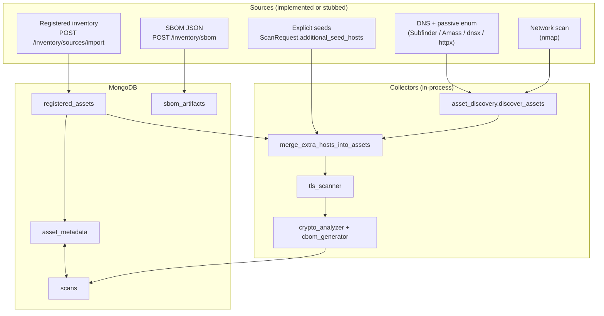

# Architecture — Discovery & crypto inventory (org-wide alignment)

This document maps the **proposed “Phase 1: Discovery & Inventory”** story to **what QuantumShield implements today** and how the backend is structured after the inventory extensions.

---

## 1. Target picture (your diagram)

| Layer | Intent |
|-------|--------|
| **Asset sources** | CMDB, cloud, DNS/ranges, K8s/mesh, Git, PKI/KMS/HSM |
| **Collectors** | Network scanner, SAST, PKI/KMS connectors |
| **Crypto asset inventory** | TLS endpoints, cert chains, keys, symmetric/hash/signature use, libraries |

---

## 2. Implemented backend architecture (as-built)

**Scan pipeline (Stage 1)** now does:

1. **Passive + active discovery** — unchanged: `discover_assets(domain)` → subdomains, live hosts, **nmap** per target.  
2. **Inventory merge** — `merge_extra_hosts_into_assets` adds any host from:
   - `ScanRequest.additional_seed_hosts` (API-supplied list), and/or  
   - `registered_assets` when `merge_registered_inventory=true` (scoped to the scan `domain`).  
3. **Metadata overlay** — existing merge from `asset_metadata` (now also fed by import).

Later stages still produce **TLS endpoints**, **cert + chain** (`TLSInfo`), **cipher/KX-derived CBOM components** — not application **library versions** unless you attach **SBOMs** via `POST /inventory/sbom` (stored for correlation; full “libraries/versions in UI” would be a follow-on).

---

## 3. What is still “connector-shaped” vs full enterprise

| Diagram item | Status |
|--------------|--------|
| CMDB / cloud / K8s / Git / PKI / KMS | **No live APIs** — use **`/inventory/sources/import`** with `source` labels (`cmdb`, `cloud`, `k8s`, `git`, …) to represent upstream jobs. |
| SAST | **Stub** — ingest SBOM JSON with **`/inventory/sbom`**; no in-repo scanner. |
| PKI/KMS/HSM connectors | **Not implemented** — certs from **TLS observation** only. |
| Libraries/versions in inventory | **Partial** — TLS-derived CBOM + optional **SBOM documents** in Mongo. |

---

## 4. New / changed API surface

| Method | Path | Role |
|--------|------|------|
| POST | `/inventory/sources/import` | Upsert `registered_assets`, mirror fields to `asset_metadata`. |
| GET | `/inventory/registered` | Query registered rows (`domain`, `source`, `limit`). |
| POST | `/inventory/sbom` | Store SBOM JSON per host. |
| POST | `/scan` body | `additional_seed_hosts`, `merge_registered_inventory`. |
| POST | `/scan/batch` body | `merge_registered_inventory` per job. |

---

## 5. New collections

| Constant | Collection | Content |
|----------|------------|---------|
| `REGISTERED_ASSETS_COLLECTION` | `registered_assets` | External catalog rows + `source` tag. |
| `SBOM_ARTIFACTS_COLLECTION` | `sbom_artifacts` | Raw SBOM payloads + metadata. |

---

*Use this file when pitching “org-wide inventory”: honest about stubs, clear about the merge path into the existing TLS/CBOM pipeline.*
