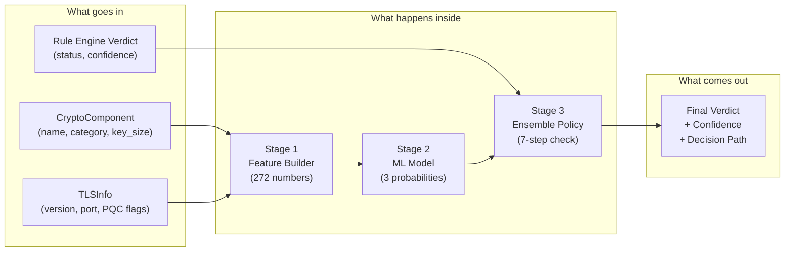
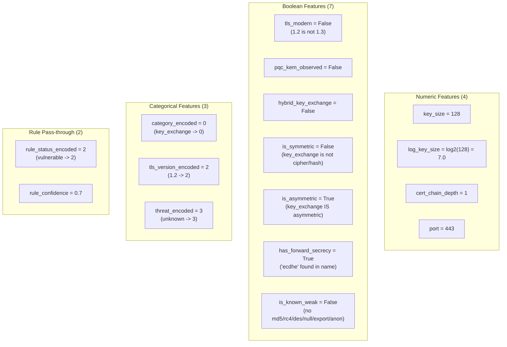
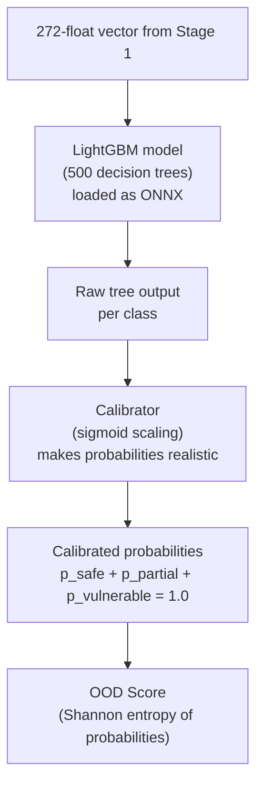
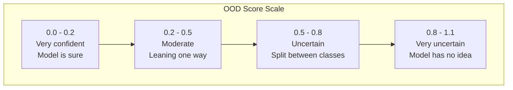
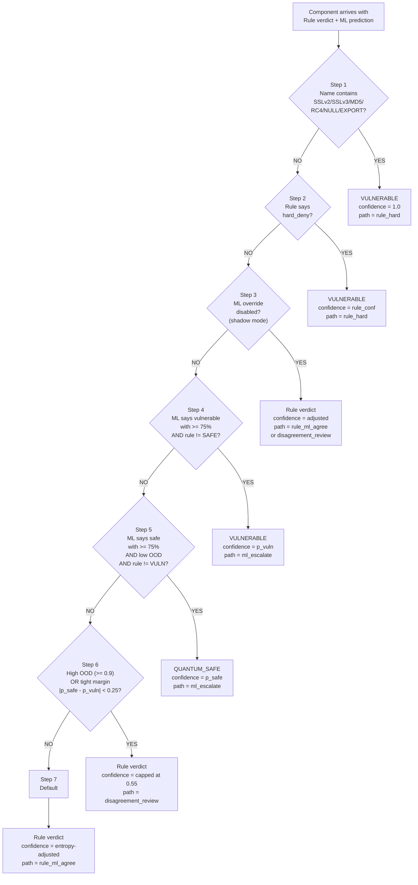
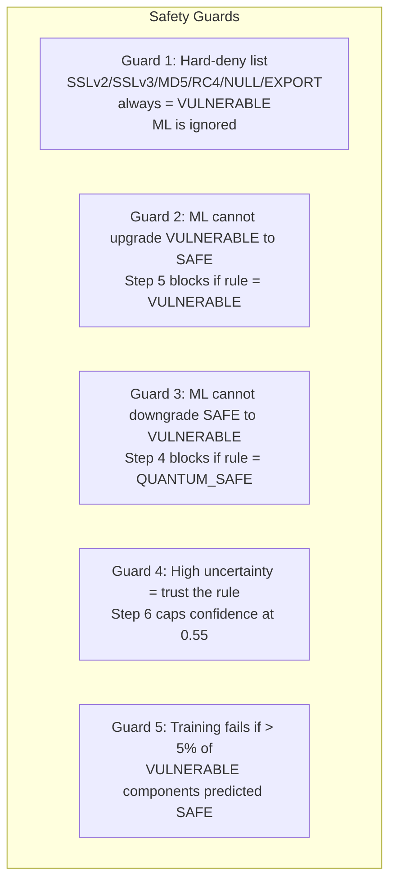

# Ensemble System: Internal Calculations

How a cryptographic component goes from raw input to final quantum-safety verdict.

---

## The Big Picture



---

## Stage 1: Feature Builder

**Job:** Turn a crypto component into 272 numbers that the ML model can read.

### What it receives

| Input | Example |
|-------|---------|
| Component name | `TLS_ECDHE_RSA_WITH_AES_128_GCM_SHA256` |
| Category | `key_exchange` |
| Key size | `128` |
| TLS version | `TLSv1.2` |
| Rule verdict | `VULNERABLE` with confidence `0.7` |

### How it builds 16 tabular features



### How it builds the 256-element text hash

This captures the "shape" of the algorithm name so the ML model can recognize similar strings.

**Step 1:** Combine the text fields:

```
"TLS_ECDHE_RSA_WITH_AES_128_GCM_SHA256 key_exchange"
```

**Step 2:** Convert to lowercase:

```
"tls_ecdhe_rsa_with_aes_128_gcm_sha256 key_exchange"
```

**Step 3:** Generate character 2-grams and 3-grams (sliding windows):

```
2-grams: "tl", "ls", "s_", "_e", "ec", "cd", "dh", "he", ...
3-grams: "tls", "ls_", "s_e", "_ec", "ecd", "cdh", "dhe", ...
```

**Step 4:** For each n-gram, compute a bucket number:

```
bucket = hash("tl") % 256 = 42
bucket = hash("ls") % 256 = 187
bucket = hash("dh") % 256 = 91
...
```

**Step 5:** Count how many n-grams fall in each bucket (max 10 per bucket):

```
Bucket 0:  0
Bucket 1:  0
Bucket 2:  2  <-- two n-grams hashed here
...
Bucket 42: 1  <-- "tl" hashed here
...
Bucket 91: 3  <-- "dh" and two others hashed here
...
```

**Result:** A 256-element integer vector like `[0, 0, 2, 0, 1, 0, 3, ...]`

### Final output: 272-dimensional vector

```
[128.0, 7.0, 1.0, 443.0,           <-- 4 numeric
 0.0, 0.0, 0.0, 0.0, 1.0, 1.0, 0.0, <-- 7 boolean (as 0/1)
 0.0, 2.0, 3.0,                     <-- 3 categorical
 2.0, 0.7,                          <-- 2 rule pass-through
 0, 0, 2, 0, 1, 0, 3, ...]          <-- 256 text hash buckets
```

---

## Stage 2: ML Inference

**Job:** Take the 272 numbers and predict three probabilities: how likely is this component to be SAFE, PARTIAL, or VULNERABLE?

### What happens inside



### How the 500 trees vote

The LightGBM model has 500 decision trees. Each tree looks at the 272 features and votes for one class. Example:

```
Tree 1: looks at is_known_weak=0 and category=0 -> votes SAFE
Tree 2: looks at text_hash[42]=1 and key_size=128 -> votes PARTIAL
Tree 3: looks at rule_status=2 and has_forward_secrecy=1 -> votes VULNERABLE
...
Tree 500: looks at log_key_size=7.0 and is_asymmetric=1 -> votes PARTIAL
```

The votes are aggregated into raw scores, then the calibrator converts them to probabilities that sum to 1.0.

### How probabilities are calibrated

The raw LightGBM output might say `[0.42, 0.55, 0.03]`. The calibrator (Platt sigmoid scaling) adjusts these so they better reflect true likelihood:

```
Raw:        [0.42, 0.55, 0.03]
Calibrated: [0.460, 0.522, 0.018]  (sum = 1.000)
```

### How OOD score is calculated

OOD (Out-of-Distribution) score measures how confused the model is. It uses Shannon entropy:

```
OOD = -(p_safe * ln(p_safe) + p_partial * ln(p_partial) + p_vuln * ln(p_vuln))
```

**Example with our input:**

```
OOD = -(0.460 * ln(0.460) + 0.522 * ln(0.522) + 0.018 * ln(0.018))
    = -(0.460 * -0.777  +  0.522 * -0.650  +  0.018 * -4.017)
    = -(-0.357           +  -0.339           +  -0.072)
    = -(-0.768)
    = 0.768
```

**What different OOD values mean:**



- **Minimum possible:** 0.0 (all probability on one class, like `[1.0, 0.0, 0.0]`)
- **Maximum possible:** ln(3) = 1.099 (uniform distribution `[0.333, 0.333, 0.333]`)

### Output: MLAssessment

```
p_safe       = 0.460    (46.0% chance it is quantum-safe)
p_partial    = 0.522    (52.2% chance it is partially safe)
p_vulnerable = 0.018    (1.8% chance it is vulnerable)
ood_score    = 0.768    (high uncertainty -- model is not sure)
predicted_class = 1     (argmax -> PARTIALLY_SAFE)
```

---

## Stage 3: Ensemble Decision

**Job:** Combine the rule verdict and ML prediction into one final answer. Rules win on clear cases. ML helps on uncertain ones.

### The 7-step priority cascade

The ensemble checks conditions in order. **The first match wins.** Later steps are never reached.



### Step-by-step with our example

**Input:**
- Component: `TLS_ECDHE_RSA_WITH_AES_128_GCM_SHA256`
- Rule says: `VULNERABLE` with confidence `0.7`
- ML says: `p_safe=0.460, p_partial=0.522, p_vuln=0.018, OOD=0.768`

---

**Step 1: Hard-deny string check**

Look for banned tokens in the component name (case-insensitive):

```
Name: "tls_ecdhe_rsa_with_aes_128_gcm_sha256"

Check "sslv2" in name?  NO
Check "sslv3" in name?  NO
Check "md5" in name?    NO
Check "rc4" in name?    NO
Check "null" in name?   NO
Check "export" in name? NO

Result: No match -> move to Step 2
```

---

**Step 2: Rule override tier**

```
override_tier = "none"
"none" != "hard_deny"

Result: Not a hard deny -> move to Step 3
```

---

**Step 3: Shadow mode check**

```
ml_override_enabled = True  (in this example)

Result: Override IS enabled -> move to Step 4
```

If shadow mode were active (`ml_override_enabled = False`), it would stop here and return the rule verdict. The confidence adjustment formula would be:

```
adjusted = rule_confidence * (1 - 0.3 * ood_score)
         = 0.7 * (1 - 0.3 * 0.768)
         = 0.7 * 0.770
         = 0.539
```

The `0.3 * ood_score` part means: **higher ML uncertainty reduces confidence by up to 30%**.

---

**Step 4: ML says vulnerable?**

```
p_vulnerable = 0.018
threshold    = 0.75

Is 0.018 >= 0.75?  NO

Result: ML does NOT strongly say vulnerable -> move to Step 5
```

---

**Step 5: ML says safe?**

```
p_safe    = 0.460
threshold = 0.75

Is 0.460 >= 0.75?  NO

Result: ML does NOT strongly say safe -> move to Step 6
```

---

**Step 6: High uncertainty or tight margin?**

```
OOD score = 0.768
threshold = 0.9

Is 0.768 >= 0.9?  NO

margin = |p_safe - p_vulnerable| = |0.460 - 0.018| = 0.442

Is 0.442 < 0.25?  NO

Result: Not high uncertainty, not tight margin -> move to Step 7
```

---

**Step 7: Default -- rule verdict with ML-adjusted confidence**

```
entropy = -(0.460 * ln(0.460) + 0.522 * ln(0.522) + 0.018 * ln(0.018))
        = 0.768

max_entropy = ln(3) = 1.0986

normalized_entropy = 0.768 / 1.0986 = 0.699

adjusted_confidence = rule_confidence * (1 - 0.2 * normalized_entropy)
                    = 0.7 * (1 - 0.2 * 0.699)
                    = 0.7 * (1 - 0.140)
                    = 0.7 * 0.860
                    = 0.602
```

The formula `1 - 0.2 * normalized_entropy` means:
- If ML is very sure (entropy near 0): confidence stays at **100%** of rule value
- If ML is very confused (entropy near max): confidence drops by **20%**
- The `0.2` factor is conservative -- ML doubt only slightly reduces confidence

---

### Final output

```
final_quantum_status = "VULNERABLE"     (from the rule)
ensemble_confidence  = 0.602            (rule's 0.7, reduced by ML uncertainty)
decision_path        = "rule_ml_agree"  (default path, both layers contributed)
disagreement         = False            (final matches rule)
```

---

## All Confidence Formulas in One Place

### Shadow mode (Step 3)

```
adjusted = rule_confidence * (1 - 0.3 * ood_score)
```

| OOD score | Penalty | If rule_confidence = 0.8 |
|-----------|---------|--------------------------|
| 0.0 | 0% | 0.800 |
| 0.3 | 9% | 0.728 |
| 0.5 | 15% | 0.680 |
| 0.8 | 24% | 0.608 |
| 1.0 | 30% | 0.560 |

### Uncertainty cap (Step 6)

```
confidence = min(rule_confidence, 0.55)
```

Always capped at 0.55 when the model is confused. This signals: "needs human review."

### Default ML adjustment (Step 7)

```
normalized_entropy = entropy / ln(3)
adjusted = rule_confidence * (1 - 0.2 * normalized_entropy)
```

| Entropy state | Normalized | Penalty | If rule_confidence = 0.8 |
|---------------|-----------|---------|--------------------------|
| Model is sure (one class dominates) | 0.0 | 0% | 0.800 |
| Model leans one way | 0.3 | 6% | 0.752 |
| Model is split | 0.5 | 10% | 0.720 |
| Model is confused | 0.7 | 14% | 0.688 |
| Model has no idea (uniform) | 1.0 | 20% | 0.640 |

---

## Safety Guards

These are hard rules that the ML can never override:



---

## Decision Path Reference

| Path | What it means | Who decides |
|------|--------------|-------------|
| `rule_hard` | Hard-deny or override tier fired | Rules only (ML ignored) |
| `rule_ml_agree` | Both agree, or ML adjusts confidence | Rules primary, ML tunes |
| `ml_escalate` | ML overrides with high confidence | ML primary (rules allow it) |
| `disagreement_review` | ML is uncertain or disagrees | Rules primary, flagged for review |

---

## Complete Worked Examples

### Example 1: Known-weak component (hard-deny)

```
Input:  EXP-RC4-MD5 (cipher, key_size=40)
Rule:   VULNERABLE, confidence=1.0
ML:     p_safe=0.007, p_partial=0.980, p_vulnerable=0.013

Step 1: "rc4" found in name -> HARD DENY
Output: VULNERABLE, confidence=1.0, path=rule_hard
Note:   ML said PARTIAL but it does not matter -- hard-deny wins
```

### Example 2: PQC algorithm (ML agrees)

```
Input:  dilithium-v5-ietf-2024 (signature)
Rule:   QUANTUM_SAFE, confidence=0.9
ML:     p_safe=0.532, p_partial=0.007, p_vulnerable=0.461

Step 1: No hard-deny match
Step 2: No hard_deny tier
Step 3: ML override enabled -> continue
Step 4: p_vuln=0.461 < 0.75 -> skip
Step 5: p_safe=0.532 < 0.75 -> skip
Step 6: OOD=0.728 < 0.9, margin=|0.532-0.461|=0.071 < 0.25 -> YES!
Output: QUANTUM_SAFE, confidence=min(0.9, 0.55)=0.55, path=disagreement_review
Note:   ML is split between SAFE and VULN, so confidence is capped
```

### Example 3: Shadow mode (ML stored but ignored)

```
Input:  AES-256-GCM (cipher, key_size=256)
Rule:   PARTIALLY_SAFE, confidence=0.8
ML:     p_safe=0.007, p_partial=0.980, p_vulnerable=0.013

Step 1: No hard-deny
Step 2: No hard_deny tier
Step 3: ml_override_enabled=False -> SHADOW MODE
        ML predicted_class=1 (PARTIALLY_SAFE) matches rule -> agree
        adjusted = 0.8 * (1 - 0.3 * 0.113) = 0.8 * 0.966 = 0.773
Output: PARTIALLY_SAFE, confidence=0.773, path=rule_ml_agree
Note:   ML agreed and had low OOD, so confidence barely dropped
```

### Example 4: ML overrides to VULNERABLE

```
Input:  AAAA...500 chars (cipher, unknown)
Rule:   UNKNOWN, confidence=0.1
ML:     p_safe=0.007, p_partial=0.007, p_vulnerable=0.986

Step 1: No hard-deny match
Step 2: No hard_deny tier
Step 3: ML override enabled -> continue
Step 4: p_vuln=0.986 >= 0.75 AND rule != QUANTUM_SAFE -> YES!
Output: VULNERABLE, confidence=0.986, path=ml_escalate
Note:   ML was very confident this is bad, and rule didn't say SAFE
```
