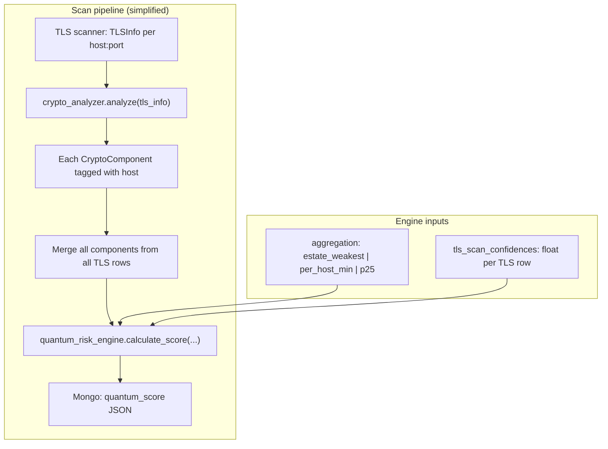
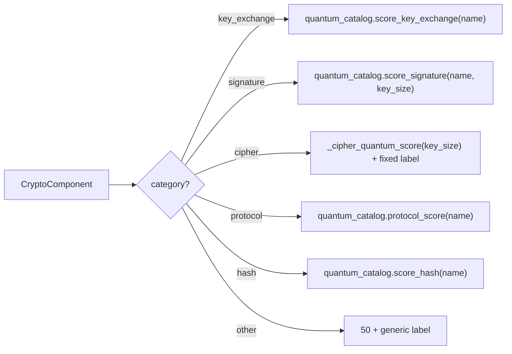
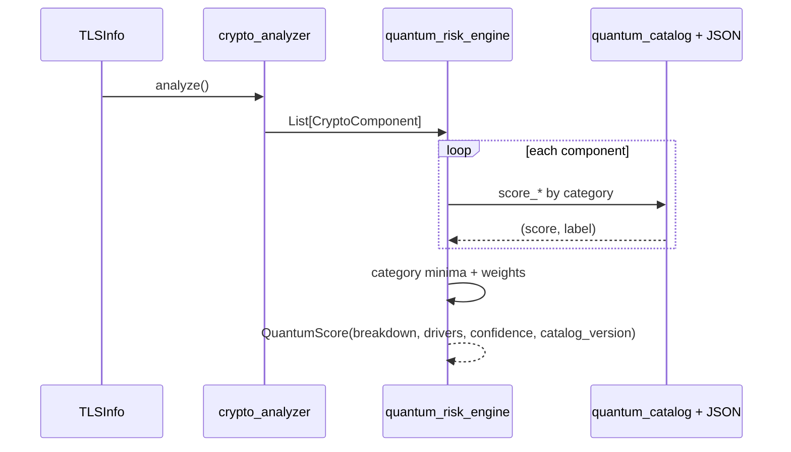

# Quantum risk scoring engine — detailed reference

This document describes **exactly** how QuantumShield computes the **Quantum Readiness Score (0–100)** after crypto analysis. It mirrors the implementation in:

- `app/modules/quantum_risk_engine.py` — orchestration, aggregation, weights, cipher curve, risk bands, drivers, confidence
- `app/modules/quantum_catalog.py` — JSON catalog load + KEX / signature / hash / protocol string scoring
- `app/modules/data/pqc_algorithm_catalog.json` — versioned rules (`catalog_version`)
- `app/modules/crypto_analyzer.py` — TLS → `CryptoComponent` list (including cert chain)
- `app/api/routes.py` — passes TLS row confidences and `QUANTUM_SCORE_AGGREGATION` from settings

It is **not** a formal crypto proof or certification narrative; align stakeholder language with [NIST IR 8547](https://csrc.nist.gov/pubs/ir/8547/ipd) (organizational PQC transition) and treat output as **observational heuristics**.

---

## 1. End-to-end pipeline

**Component sources (typical scan):**

| Source in `crypto_analyzer`      | `Al41gorithmCategory` | Notes                                                                                  |
| -------------------------------- | --------------------- | -------------------------------------------------------------------------------------- |
| Negotiated + supported protocols | `protocol`            | Multiple protocol rows possible (supported vs negotiated).                             |
| Negotiated + supported ciphers   | `cipher`              | Uses `key_size` (bits) when known.                                                     |
| Key exchange field / suite       | `key_exchange`        | Often a long cipher-suite string; catalog uses **substring** rules on normalized text. |
| Leaf certificate                 | `signature`, `hash`   | Signature base + extracted hash algorithm.                                             |
| `cert_chain[]` each entry        | `signature`, `hash`   | Same classifier; `usage_context` includes chain depth.                                 |

Each `CryptoComponent` should carry `**host`** (set in analyzer) so per-host aggregation can group correctly.

---

## 2. Per-component scoring (`_score_component_detail`)

Every component is mapped to **(score, label)** where score ∈ [0, 100] (float) and label is a short human-readable string stored for the **driver** that wins the minimum in that category.

### 2.1 Cipher (`_cipher_quantum_score`)

Uses **symmetric key size only** (Grover-style margin; not suite string parsing):

| Condition on `key_size` (bits) | Score |
| ------------------------------ | ----- |
| `None`                         | 50    |
| ≥ 256                          | 95    |
| ≥ 192                          | 80    |
| ≥ 128                          | 60    |
| < 128                          | 20    |

Driver label template: `Cipher effective bits (Grover margin): {bits or 'unknown'}`.

### 2.2 Key exchange (`score_key_exchange`)

1. `normalize_kex_for_match`: trim, replace unicode dashes, strip all whitespace, **lowercase** (suite fragments stay as one token stream, e.g. `ecdhe-rsa-aes128-gcm-sha256` → `ecdhe-rsa-aes128-gcm-sha256` with spaces removed).
2. If empty → **(30, "Key exchange unknown")**.
3. Walk `**kex_contains_rules`** in **JSON array order** (first match wins). For each rule, every `contains` token is normalized with `_norm` (lower, strip `-`, `_`, spaces); if **any** token is a **substring** of the normalized KEX string → return that rule’s `score` and `KEX: {label}`.
4. If no rule matches → **(30, "Key exchange not catalog-matched …")**.

**Implication:** Ordering in `pqc_algorithm_catalog.json` matters. PQC/hybrid tokens are listed before classical `ecdhe` so a hybrid string hits the high score first.

### 2.3 Signature (`score_signature`)

1. `_norm(name)` same as hash (lower, strip `-`/`_`/spaces).
2. If empty name → **(30, "Signature algorithm unknown")**.
3. Walk `**sig_contains_rules`** in order. If any normalized token appears in the normalized name:
  - If the name is **RSA-like** (`"rsa"` in `nl`) and **not** ML-DSA/Dilithium (`"ml"` / `"dilithium"` not used as exclusion for non-RSA — code checks `if "rsa" in nl and "ml" not in nl and "dilithium" not in nl`): compute `**_rsa_tier_score(key_size, rsa_signature_key_size_tiers)`** and return `**min(rule_base_score, tier_score)**` with label `Signature: {tier_label}`.
  - Else return rule `score` and `Signature: {label}`.
4. No match → **(30, "Signature not catalog-matched …")**.

**RSA tiers** (first tier where `key_size <= max_bits`):

| `max_bits` | Score | Example label |
| ---------- | ----- | ------------- |
| 1023       | 5     | RSA key <1024 |
| 2047       | 10    | RSA 1024–2047 |
| 3071       | 16    | RSA 2048      |
| 4095       | 20    | RSA 3072      |
| 999999     | 24    | RSA ≥4096     |

If `key_size` missing/zero for RSA path → tier helper returns **(15, "RSA (key size unknown)")** before tier table in `_rsa_tier_score`.

**Ordering caveat:** Rules are substring-based. `ecdsa` must match before a hypothetical broad `dsa` token would match `ecdsa` — the catalog lists `ecdsa` before `dsa`.

### 2.4 Hash (`score_hash`)

1. `_norm(name)`.
2. Empty → **(50, "Hash unknown")**.
3. Walk `**hash_contains_rules`** in order; first substring match wins.
4. No match → **(72, "Hash posture (name)")** — “unknown but not terrible” default.

### 2.5 Protocol (`protocol_score`)

1. Load `protocol_scores` map from catalog.
2. Exact key match on stripped `protocol_name`, else fuzzy loop comparing normalized / uppercase forms.
3. Unknown → **(40, "Protocol unknown …")**.

---

## 3. Category minima (“weakest link”) — `_category_mins`

For each `AlgorithmCategory` present in the input list:

1. Collect **all** `(score, label)` pairs for components of that category.
2. `**min` by score**; ties break by Python’s `min` on tuples (first encountered minimum wins for label stability).

Outputs:

- `category_min[cat]` = minimum score for that category.
- `cat_labels[cat]` = label attached to that minimum.

---

## 4. Single aggregate over one component list — `_compute_single`

Used for:

- The full list when `aggregation == "estate_weakest"`, and  
- **Each host’s sublist** when aggregation is `per_host_min` or `p25`.

### 4.1 Breakdown object (`QuantumScoreBreakdown`)

| Field                | Value                                                            |
| -------------------- | ---------------------------------------------------------------- |
| `key_exchange_score` | `category_min[key_exchange]` or **0** if absent                  |
| `signature_score`    | `category_min[signature]` or **0** if absent                     |
| `cipher_score`       | `category_min[cipher]` if present, else **50** (display default) |
| `protocol_score`     | `category_min[protocol]` if present, else **50**                 |
| `hash_score`         | `category_min[hash]` if present, else **50**                     |

So **0 vs 50** defaults differ: missing KEX/SIG show 0 in breakdown; missing cipher/protocol/hash show **50** as neutral display.

### 4.2 Weighted final score (critical)

Let `**present`** = set of categories that appear on **at least one** component in this list.

\text{score} = \mathrm{round}\left(
\frac{\sum_{c \in \text{present} \cap \text{categorymin}} w_c \cdot m_c}{\sum_{c \in \text{present} \cap \text{categorymin}} w_c},
1\right)

where m_c is the category minimum and weights w_c are:

| Category       | Weight w_c |
| -------------- | ---------- |
| `key_exchange` | 0.36       |
| `signature`    | 0.28       |
| `cipher`       | 0.18       |
| `protocol`     | 0.08       |
| `hash`         | 0.10       |

**Categories not in `present` do not contribute to the denominator.** So a scan with no HASH components does not renormalize weights; HASH is simply omitted.

If no weights apply (`total_w == 0`), score is **0**.

### 4.3 Display labels for drivers

`disp_labels` copies `cat_labels` and, for any of cipher/protocol/hash **missing** from `category_min`, sets placeholder labels:

- `"No cipher in subset (display 50)"` etc.

These placeholders matter for `**_top_negative_drivers`** (see §6).

---

## 5. Aggregation modes — `calculate_score`

Common steps:

1. `catalog_version = quantum_catalog.get_catalog_version()`.
2. `confidence = _confidence_from_tls_levels(tls_scan_confidences)` (§7).
3. If `components` empty → fixed critical outcome with `confidence=max(0.3, confidence*0.85)` (§8).

### 5.1 `estate_weakest` (default)

One call: `_compute_single(all_components)` → `package(...)`.

All hosts’ components compete in the **same** category minima pool.

### 5.2 `per_host_min` and `p25`

1. Group components by `host` (stripped); empty host → `"_unknown_"`.
2. For each group: `(score_host, breakdown_host, labels_host) = _compute_single(group_components)`.
3. Build `host_rows` = list of `(score_host, breakdown_host, labels_host)`.
4. **Sort by `score_host` ascending** (lower score = worse readiness).

Then:

- `**per_host_min`:** take the first row after sort → **worst host’s** full breakdown and score.
- `**p25`:** with n hosts, index i = \lfloor 0.25 \cdot (n - 1) \rfloor, clamped to [0, n-1]. Pick `**host_rows[i]`** after ascending sort — i.e. the host at the **25th percentile** of per-host scores (low scores first, so this is the “less pessimistic” estate view than absolute min).

The returned `**breakdown` and `drivers`** come from the **selected** host row for per_host_min / p25, not from a recomputed global pool.

---

## 6. Drivers — `_top_negative_drivers`

Input maps:

- Numeric values are taken from `**breakdown`** (the five floats shown to users), **not** re-read from `category_min` alone.
- Labels come from `cat_labels` / `disp_labels` aligned with those categories.

Algorithm:

1. Build list of `(category, score)` for all five categories.
2. Sort by **ascending score** (lowest = worst for “readiness”).
3. Take first **3** entries.
4. Format: `{category.value} ({score:.0f}/100): {label}`.

So drivers highlight **which displayed category columns are dragging the score down**, with the catalog-derived explanation for the true minima where applicable.

---

## 7. Confidence — `_confidence_from_tls_levels`

Input: optional list of floats (one per TLS row, **pre-mapped** in `routes.py`):

| Raw `TLSInfo.confidence` | Float |
| ------------------------ | ----- |
| `high`                   | 0.9   |
| `medium`                 | 0.7   |
| `low`                    | 0.5   |
| missing / other          | 0.65  |

Engine logic:

- If list empty or all unusable → **0.65**.
- Else `**confidence = min(all floats)`**, then clamp to **[0.2, 1.0]**.

So one low-confidence endpoint pulls the whole scan’s quantum confidence down (conservative).

---

## 8. Empty component list

Returns `QuantumScore` with:

- `score = 0`, `risk_level = critical`
- Default `QuantumScoreBreakdown()` (all zeros / defaults per model)
- `summary` = no components message
- `confidence = max(0.3, confidence * 0.85)` (slightly discount even if TLS gave high confidence)
- `drivers = ["No CBOM components to score"]`
- `catalog_version` still set from catalog loader
- `aggregation` echoed from parameter

---

## 9. Risk level bands — `_risk_level_from_score`

| Score range | `RiskLevel` |
| ----------- | ----------- |
| ≥ 80        | `safe`      |
| ≥ 60        | `low`       |
| ≥ 40        | `medium`    |
| ≥ 20        | `high`      |
| < 20        | `critical`  |

---

## 10. Human summary — `_summary_text`

Independent checklist on **breakdown thresholds** (not on drivers):

- KEX < 40 → ML-KEM / hybrid TLS hint
- Sig < 40 → ML-DSA / SLH-DSA hint
- Cipher < 60 → AES-256 hint
- Hash < 50 → SHA-1/MD5 hint
- If none triggered → generic positive line

Always ends with `Overall score: {score}/100.`

---

## 11. `QuantumScore` payload (API / Mongo)

| Field             | Meaning                                |
| ----------------- | -------------------------------------- |
| `score`           | Weighted result (§4.2), one decimal    |
| `risk_level`      | §9                                     |
| `breakdown`       | §4.1                                   |
| `summary`         | §10                                    |
| `confidence`      | §7                                     |
| `catalog_version` | From JSON `catalog_version` or builtin |
| `drivers`         | Up to 3 strings, §6                    |
| `aggregation`     | Which mode was used                    |

---

## 12. Simulation alignment (`threat_nist_mapping.simulate_quantum_score`)

- If scan has a non-empty parsable `**cbom`**: baseline and projected scores both use `**calculate_score**` on patched `CryptoComponent` lists (same catalog), with TLS-derived confidence list when available.
- If no CBOM: legacy **stored score + TLS fraction deltas**; `catalog_version` empty in response.

---

## 13. Configuration

| Setting                     | Location                 | Values                                            |
| --------------------------- | ------------------------ | ------------------------------------------------- |
| `QUANTUM_SCORE_AGGREGATION` | `app/config.py` / `.env` | `estate_weakest` (default), `per_host_min`, `p25` |

Invalid values fall back to `estate_weakest` in `routes.py`.

---

## 14. Tests and fixtures

- Unit tests: `tests/test_quantum_risk_engine.py`
- JSON bands: `tests/fixtures/quantum_vectors.json`

---

## 15. Sequence diagram (single host, estate_weakest)

This file is the canonical **in-depth** description of the engine; when the code changes, update this document in the same PR.