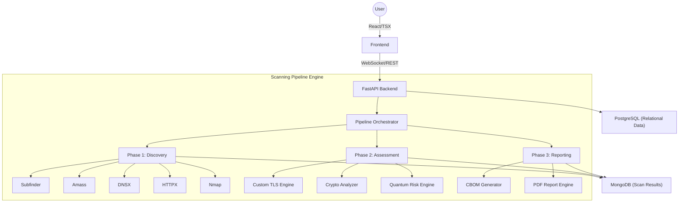

# QuantumShield — Quantum-Safe Cryptographic Assessment System

QuantumShield is a professional-grade security platform designed for the **PNB Cybersecurity Hackathon 2026**. It provides end-to-end visibility into an organization's cryptographic posture, specifically focusing on readiness for the Post-Quantum (PQ) era.

---

## 🏗️ Architecture Deep-Dive

The system utilizes a **modular, asynchronous pipeline architecture** built on FastAPI. This design ensures that each stage of the assessment can Scale independently and handle long-running reconnaissance tasks without blocking the user interface.

### 🧩 High-Level Architecture Flow



---

## 🔍 Asset & Subdomain Discovery Logic

The core strength of QuantumShield lies in its multi-stage discovery process, which ensures no shadow infrastructure is missed.

### 1. Passive Reconnaissance (Subfinder & Amass)
- **Subfinder**: Scrapes 30+ passive sources (Censys, Chaos, GitHub, etc.) to find subdomains recorded in historical logs and certificates. It is extremely fast and generates zero noise on the target network.
- **Amass**: Conducts deep passive enumeration by traversing multiple data sources and building an initial graph of the organization's internet footprint.

### 2. Live Verification (DNSX)
- Raw subdomain lists often contain stale entries. **DNSX** is used as a high-speed multi-threaded resolver to verify which subdomains actually have active DNS records (A, AAAA, CNAME).

### 3. Service Fingerprinting (HTTPX & Nmap)
- **HTTPX**: Probes verified subdomains to identify running web services, capturing status codes, page titles, and technology headers.
- **Nmap**: Performs a focused port scan (specifically targeting SSL/TLS ports) to discover hidden services on non-standard ports (e.g., 8443, 8080) and identifies the underlying OS/Service type.

---

## 🛠️ Integrated Security Tools

| Tool | Role in Pipeline | Mechanism |
| :--- | :--- | :--- |
| **Subfinder** | Subdomain Search | Passive API aggregation |
| **Amass** | Deep Enumeration | Passive infrastructure mapping |
| **DNSX** | Resolution | Multi-threaded DNS validation |
| **HTTPX** | Web Discovery | HTTP/HTTPS service probing |
| **Nmap** | Port Scanning | TCP SYN scanning & service detection |
| **Custom Engine** | TLS Inspection | Deep protocol handshake analysis |
| **PQC Engine** | Readiness Scoring | Cryptographic algorithm risk mapping |

---

## 🔐 The Post-Quantum Assessment Logic

Once assets are discovered, the **Quantum Risk Engine** performs a qualitative analysis of every cryptographic component:

1.  **Harvest-Now-Decrypt-Later (HNDL) Check**: Identifies key exchanges like RSA and Diffie-Hellman that are vulnerable to future quantum computers (Shor's Algorithm).
2.  **Quantum Readiness Scoring**: Each asset is assigned a score (0-1000) based on its support for NIST PQC standards (e.g., Kyber, Dilithium) and modern TLS 1.3 configurations.
3.  **CBOM Generation**: All identified algorithms, key lengths, and certificate authorities are compiled into a **Cryptographic Bill of Materials**, providing the organization with a definitive crypto-inventory.

---

## 🚀 Getting Started

### Backend Setup
1.  Navigate to `Backend/`.
2.  Create a virtual environment: `python -m venv venv`.
3.  Activate it and install dependencies: `pip install -r requirements.txt`.
4.  Configure `.env` with your `MONGO_URI` and `POSTGRES_URL`.
5.  Run: `uvicorn app.main:app --host 0.0.0.0 --port 8000 --reload`.

### Frontend Setup
1.  Navigate to `Frontend/`.
2.  Run `npm install` and then `npm run dev`.
3.  Access the dashboard at `http://localhost:8080`.

---

## 📂 Project Structure

```text
.
├── Backend/
│   ├── app/
│   │   ├── api/          # REST & WebSocket Controllers
│   │   ├── modules/      # Discovery & Assessment Engines
│   │   ├── db/           # NoSQL & SQL Connectors
│   │   └── schemas/      # Unified Data Models
│   └── requirements.txt
├── Frontend/
│   ├── src/
│   │   ├── pages/        # Modern Dashboard & Tier Views
│   │   └── services/     # API & Real-time Integration
│   └── package.json
└── README.md             # This Documentation
```

