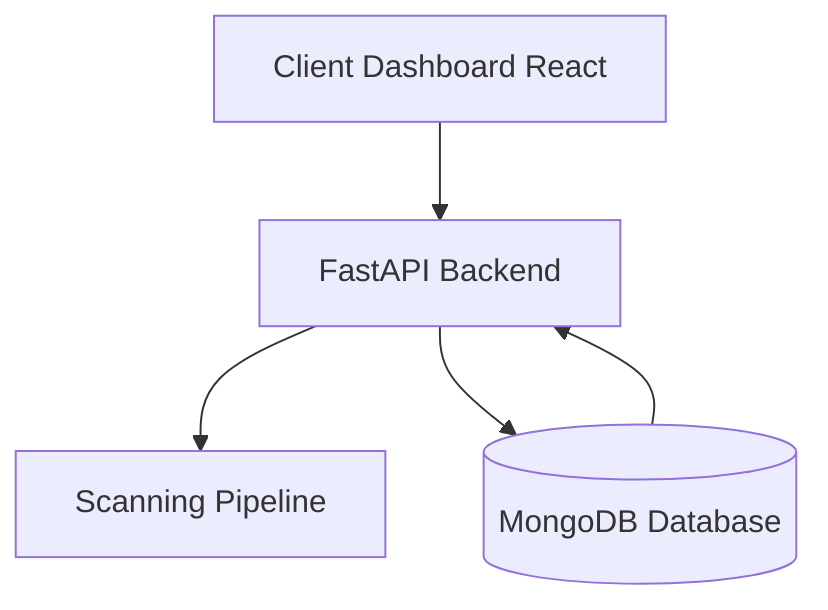
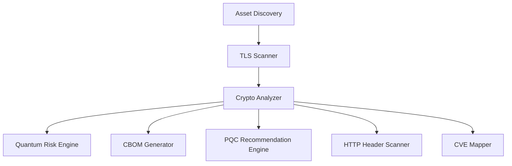

# Software Requirement Specification (SRS)

## PNB Hackathon 2026

**Software Requirement Specification**  
**Version 1**

**Project Name:** QuantumShield - Quantum-Proof Systems Scanner  
**Team Name:** [To be filled by the team]  
**Institute Name:** [To be filled by the team]

---

## 1. Introduction
### 1.1 Purpose

The purpose of this Software Requirements Specification (SRS) document is to identify and document the user requirement for QuantumShield. This document is prepared with the following objectives: 
* To provide behaviour of the system 
* To provide Process Flow charts 

### 1.2 Scope 

* Discover cryptographic inventory (TLS certificates, VPN endpoints, APIs). 
* Identify cryptographic controls (cipher suites, key exchange mechanisms, TLS versions). 
* Validate whether deployed algorithms are quantum-safe. 
* Generate actionable recommendations for non-PQC ready assets. 
* Issue digital labels: Quantum-Safe, PQC Ready, or Fully Quantum Safe. 
* Enterprise wide console for Central management: A GUI console to display status of scanned systems (public facing applications) covering details mentioned in Appendix-A (Cert-In CBOM Elements). As per the variation of score (like High, Medium, Low rating etc) for any public applications, dashboard should display that change as well.

### 1.3 Intended Audience 

The intended audience of this document is only users of PNB.

## 2. Overall Description
### 2.1 Product Perspective

QuantumShield is a modular cybersecurity platform that scans public-facing banking infrastructure for cryptographic vulnerabilities and evaluates their readiness for quantum-resistant security.

**The system architecture consists of:**

**Scanning Pipeline Architecture:**

### 2.2 Product Functions 

QuantumShield provides the following major functions:

* Asset discovery using subdomain enumeration and network scanning
* TLS protocol and cipher suite detection
* Cryptographic algorithm classification
* Detection of insecure algorithms and protocols
* Generation of Cryptographic Bill of Materials (CBOM)
* Quantum risk scoring
* PQC migration recommendations
* Detection of known cryptographic attacks
* HTTP security header validation
* Dashboard visualization and reporting

### 2.3 User Classes and Characteristics 

**Examples:**
* **Primary Users:** PNB Cybersecurity Team, PNB IT Division (Head Office), PNB System Administrators. 
* **Secondary Users:** PNB Information Security Group (ISG), PNB Compliance Auditors. Users are expected to have technical knowledge of cryptography and networking. 

| User at | User Type | Menus for User |
| :--- | :--- | :--- |
| PNB / IIT Kanpur officials | Admin User | All administrative menus |
| PNB | Checker | Review and audit menus |

### 2.4 Operating Environment 

The operating environment for the 'QuantumShield' as listed below. 

* **Server system**
* **Operating system:** Linux (Kali / Ubuntu)
* **Database:** MongoDB
* **Platform:** Web Browser
* **Technology:** Python, React, FastAPI
* **API:** RESTful APIs

### 2.5 Design and Implementation Constraints 

**1. Technical Constraints: - (For Deployment)**
* **Network Configuration:** e.g. The application must support private (intranet) IP addressing. Appropriate firewalls and routing rules must be configured. 
* **Hosting Environment:** e.g. Should deploy in intranet i.e. for intranet access. 

**2. Security Constraints**
* **Access Control:** e.g. (RBAC) 
* **Data Encryption:** e.g. all data transmitted over the internet must be used by HTTPS. 

**3. Performance Constraints**
* **Failover Mechanisms:** e.g. Ensure redundancy and failover mechanisms are in place for both environments to maintain availability. 

**4. User Interface Constraints**
* **User Experience Consistency:** e.g. Maintain consistent design and navigation elements across both environments to minimize confusion for users switching between them. 

**Examples:** 
* Must comply with NIST PQC standards. 
* Must operate only on public-facing applications. 
* Must not disrupt live banking services. 
* Must generate reports in machine-readable formats (JSON, XML, CSV). 

### 2.6 Assumptions and Dependencies 

**Assumptions:** 
* **Standard Browser Support:** e.g. It is assumed that end users will be accessing the application using HTML5-compliant browser such as Google Chrome.   
* **Examples:** Assumes TLS-based communication is used in all public-facing applications. Assumes internet connectivity for scanning endpoints.

**Dependencies:** 
* **Database System:** e.g. The application is dependent on MongoDB database for data storage. Any maintenance, downtime, or performance issues with the database will directly impact on the application's functionality. 
* **Examples:** Depends on NIST PQC algorithms being standardized and available.

## 3. Specific Requirements
### 3.1 Functional Requirements

The system shall:

* **FR1** – Discover public-facing assets using domain scanning tools.
* **FR2** – Identify supported TLS protocol versions.
* **FR3** – Enumerate all supported cipher suites.
* **FR4** – Detect certificate chain and expiration information.
* **FR5** – Classify cryptographic algorithms according to risk level.
* **FR6** – Detect known cryptographic vulnerabilities.
* **FR7** – Generate Cryptographic Bill of Materials (CBOM).
* **FR8** – Calculate a Quantum Readiness Score.
* **FR9** – Provide migration recommendations to PQC algorithms.
* **FR10** – Display results via a web dashboard.

### 3.2 External Interface Requirements

#### 3.2.1 User Interfaces
The application shall provide a web-based user interface accessible via a web browser - Google Chrome. 

#### 3.2.2 Hardware Interfaces
The system requires:
* Server infrastructure for backend processing
* Network interface for scanning external systems
* Storage infrastructure for storing scan results

#### 3.2.3 Software / Communication Interfaces
The backend communicates with:
* MongoDB database
* React frontend via REST APIs
* External scanning tools

**APIs include:**
* `POST /api/v1/scan`
* `GET /api/v1/results/{domain}`
* `GET /api/v1/cbom/{domain}`
* `GET /api/v1/quantum-score/{domain}`

### 3.3 System Features
The key features of QuantumShield include:

* Asset discovery engine
* TLS protocol analysis
* Cipher suite detection
* Certificate chain validation
* Quantum readiness scoring
* Cryptographic Bill of Materials
* PQC migration recommendations
* CVE vulnerability detection
* HTTP security header validation
* Centralized dashboard monitoring

### 3.4 Non-Functional Requirements

#### 3.4.1 Performance Requirements
* The system should scan a domain within 2 minutes.
* The scanning pipeline should operate asynchronously.
* API response times should be under 500 ms.

#### 3.4.2 Software Quality Attributes

| Attribute | Description |
| :--- | :--- |
| **Reliability** | System should operate continuously without crashes |
| **Scalability** | Must support scanning of multiple domains |
| **Maintainability** | Modular architecture for easy updates |
| **Usability** | Dashboard must be intuitive |

#### 3.4.3 Other Non-Functional Requirements
* Logs must be maintained for all scan operations.
* Reports should be exportable in JSON, CSV, and PDF formats.
* System must support future PQC algorithm updates.

## 4. Technological Requirements

* **Technologies used in development of the web application:** Python, React, FastAPI
* **I.D.E. (Integrated Development Environment):** Visual Studio Code, PyCharm
* **Database Management Software:** MongoDB

## 5. Security Requirements

The following points shall be considered at a minimum while preparing the security requirements for the system or system application: 

* **Compatibility of the proposed system with current IT set up. Impact on existing systems should be estimated:** Existing system would not be affected. 
* **Audit Trails for all important events capturing details like user ID, time and date, event etc.:** All the responses received from API are logged in DB 
* **Control Access to Information and computing facilities based on principals like 'segregation of duty', 'need-to-know', etc:** Only Admin user will be able to schedule the application 
* **Recoverability of Application in case of Failure:** Will be recovered from DR (Disaster Recovery)
* **Compliance with any legal, statutory and contractual obligations:** Must comply with NIST PQC standards and CERT-IN CBOM reporting guidelines.
* **Security vulnerabilities involved when connecting with other systems and applications:** Will be found during Audit
* **Operating environment security:** e.g. TLS 1.2 and above
* **Cost of providing security to the system over its life cycle (includes hardware, software, personnel and training):** To be determined based on deployment scale.
